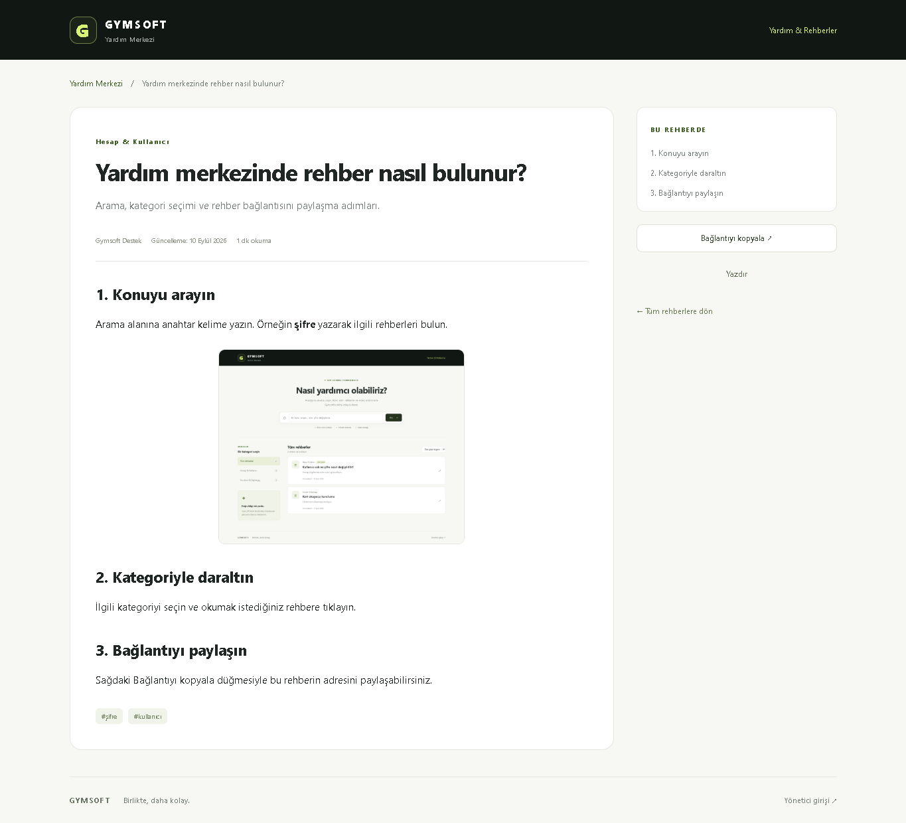
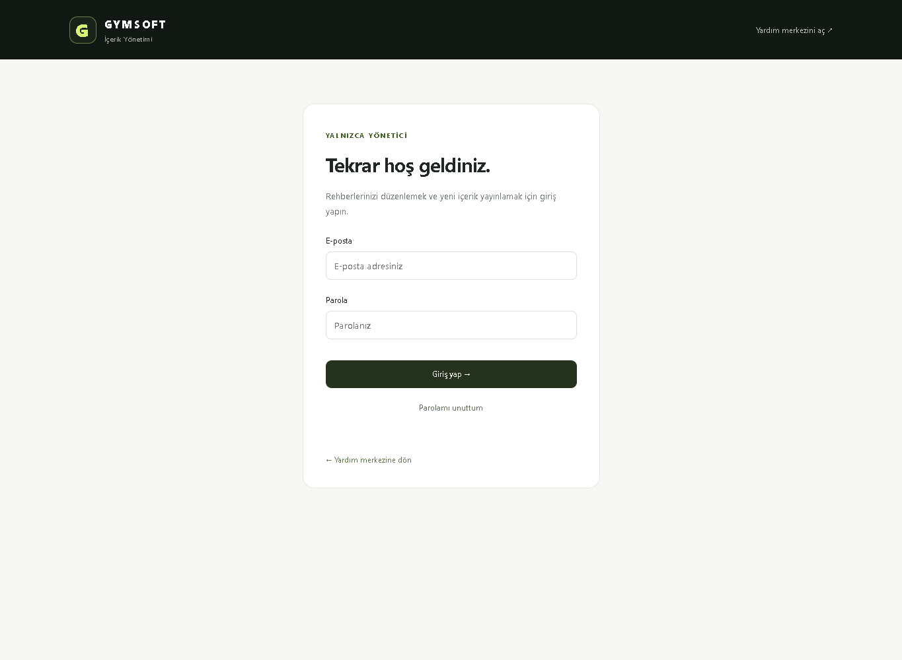
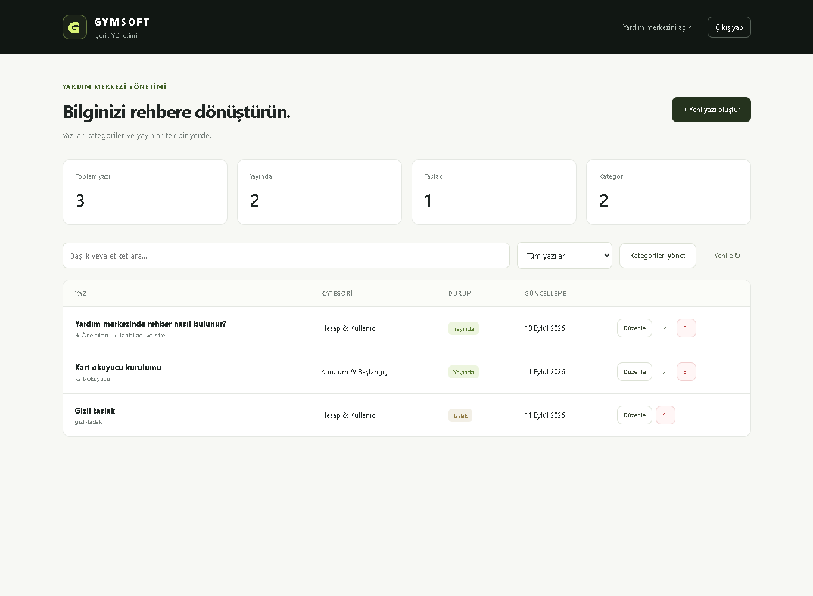
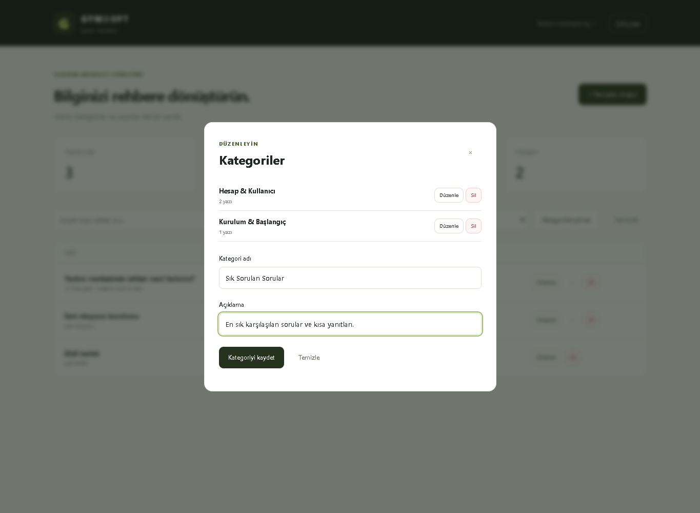
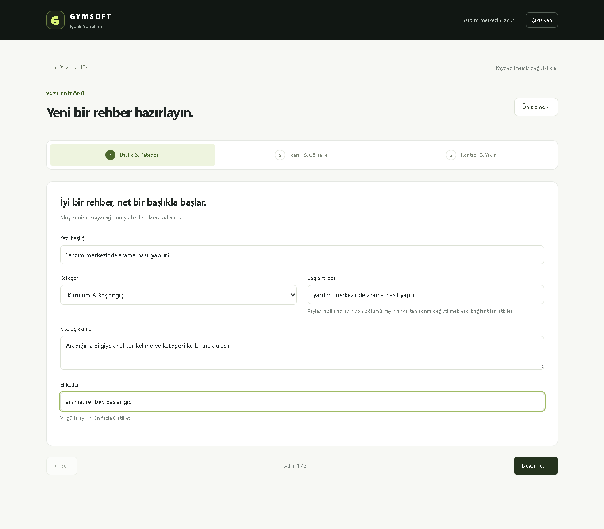
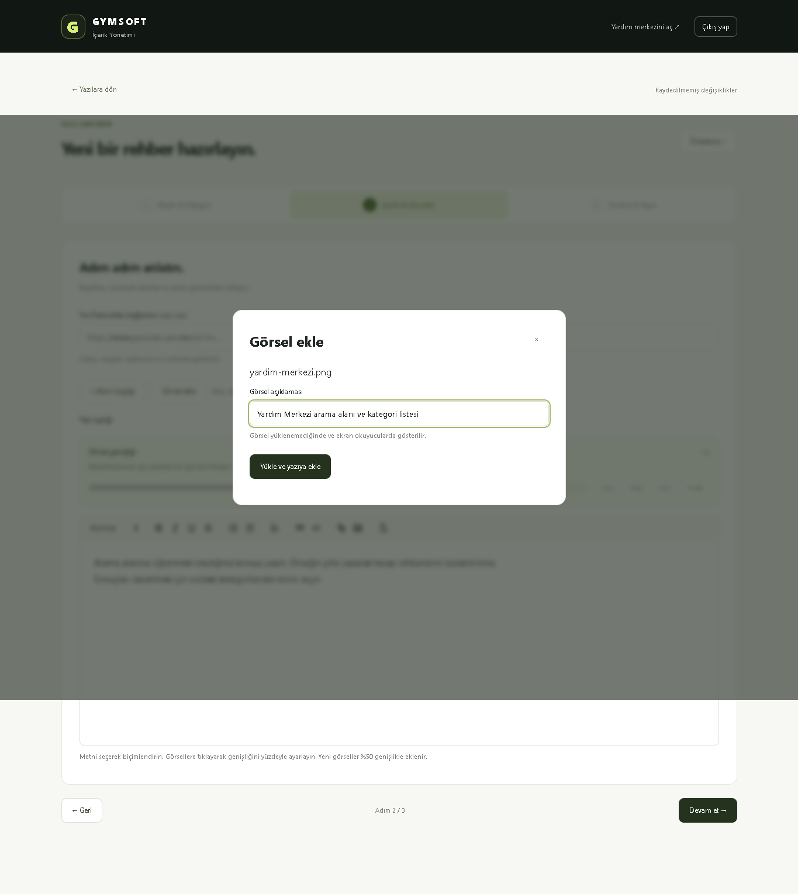
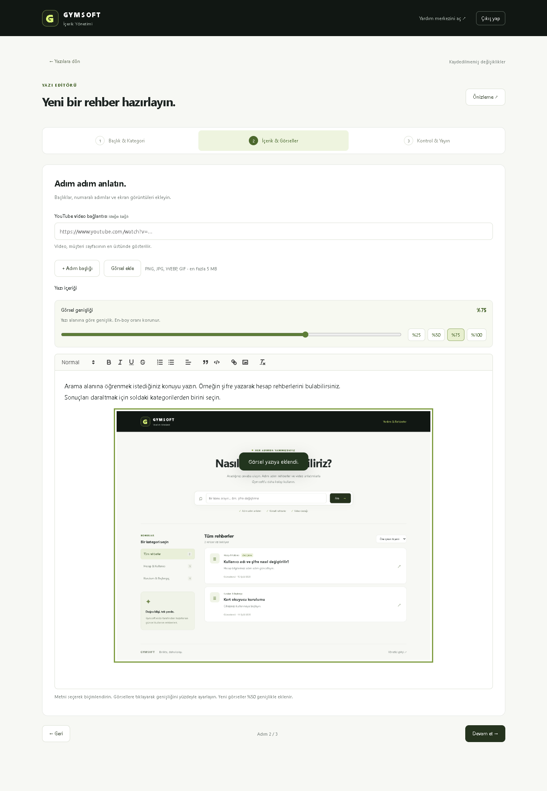
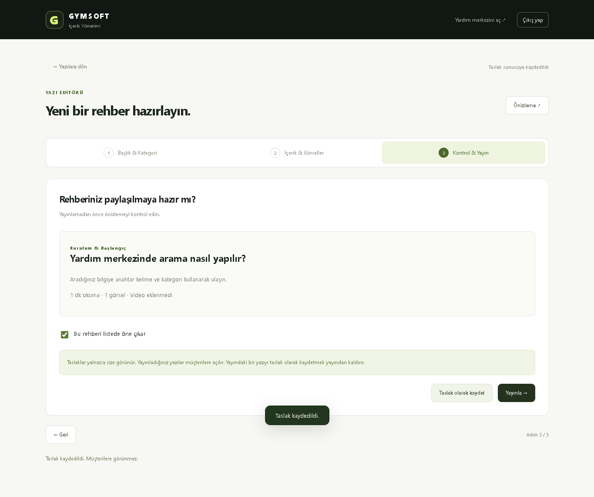

# Gymsoft Forum / Yardım Merkezi — Kullanım Rehberi

Bu rehber, ziyaretçilerin yardım yazılarını bulmasını ve yöneticinin yeni yazılar hazırlayıp yayınlamasını anlatır.

**Yardım Merkezi:** https://gymsoft-software.github.io/KartTasarim/Destek/  
**Yönetici girişi:** https://gymsoft-software.github.io/KartTasarim/Destek/admin.html

> Ekran görüntüleri 21 Eylül 2026 tarihindeki uygulama arayüzünden, örnek içeriklerle alınmıştır. Gerçek hesap bilgileri kullanılmamış ve canlı sitede değişiklik yapılmamıştır. Başlıklar ve yazı sayıları sizin ekranınızda farklı olabilir.

## İçindekiler

1. [Kim, ne yapabilir?](#1-kim-ne-yapabilir)
2. [Rehber arama ve kategori seçme](#2-rehber-arama-ve-kategori-seçme)
3. [Yazı okuma ve paylaşma](#3-yazı-okuma-ve-paylaşma)
4. [Yönetici girişi](#4-yönetici-girişi)
5. [Yönetim paneli](#5-yönetim-paneli)
6. [Kategori oluşturma ve düzenleme](#6-kategori-oluşturma-ve-düzenleme)
7. [Yeni yazı oluşturma](#7-yeni-yazı-oluşturma)
8. [Görsel ekleme ve boyutlandırma](#8-görsel-ekleme-ve-boyutlandırma)
9. [Önizleme, taslak ve yayınlama](#9-önizleme-taslak-ve-yayınlama)
10. [Yazı güncelleme, yayından kaldırma ve silme](#10-yazı-güncelleme-yayından-kaldırma-ve-silme)
11. [Sık karşılaşılan durumlar](#11-sık-karşılaşılan-durumlar)

## 1. Kim, ne yapabilir?

Sistemde forum olarak adlandırılan alan, mevcut sürümde bir **Yardım Merkezi** olarak çalışır.

| Kullanıcı | Yapabilecekleri |
| --- | --- |
| Ziyaretçi / müşteri | Giriş yapmadan yayınlanmış yazıları arar, okur, paylaşır ve yazdırır. |
| Atanmış yönetici | Giriş yaparak yazı ve kategori oluşturur, içerik düzenler, görsel yükler ve yayınları yönetir. |

Müşteri üyeliği, yorum yazma, müşterilerin konu açması ve konuya cevap verme özelliği bu sürümde bulunmaz. Taslak yazılar müşterilere gösterilmez.

## 2. Rehber arama ve kategori seçme

1. Yardım Merkezi adresini açın.
2. **Bir konu arayın…** alanına konuyu yazın. Örneğin `şifre`, `kart` veya `kurulum` yazabilirsiniz.
3. Gerekirse soldaki **Bir kategori seçin** bölümünden sonuçları daraltın.
4. Sağ üstteki sıralama alanından **Öne çıkan & yeni** veya **Başlığa göre A–Z** seçin.
5. Okumak istediğiniz yazıya tıklayın.

Sonuç bulamazsanız daha kısa bir kelimeyle tekrar arayın ve seçili kategoriyi kontrol edin.

*Üstte arama, solda kategoriler, sağda rehber listesi bulunur.*

## 3. Yazı okuma ve paylaşma

- Yazıyı başlık sırasına göre okuyun; ekran görüntülerini ilgili adımla birlikte inceleyin.
- Sağdaki **Bu rehberde** bölümünden istediğiniz başlığa geçin.
- **Bağlantıyı kopyala** ile yazının adresini alın ve istediğiniz kişiye gönderin.
- **Yazdır** ile tarayıcının yazdırma ekranını açın. Tarayıcınız destekliyorsa PDF olarak kaydedebilirsiniz.
- **Tüm rehberlere dön** ile listeye geri gidin.

Yazıya YouTube videosu eklenmişse video, başlığın üstünde görünür.

*Örnek yazı; sağdaki içindekiler bağlantıları yazı içindeki başlıklardan oluşur.*

## 4. Yönetici girişi

1. Sayfanın altındaki **Yönetici girişi** bağlantısına tıklayın veya yönetici adresini doğrudan açın.
2. Daha önce oluşturduğunuz yönetici hesabının **e-posta adresini** girin. Kullanıcı adı olarak e-posta kullanılır.
3. **Parola** alanını doldurup **Giriş yap** düğmesine basın.
4. İşiniz bittiğinde üst menüdeki **Çıkış yap** düğmesini kullanın.

*Bu ekrandan yeni hesap oluşturulmaz; mevcut yetkili hesapla giriş yapılır.*

**Parolanızı unuttuysanız:** E-posta alanını doldurup **Parolamı unuttum** düğmesine basın. Gelen e-postadaki bağlantıyla yeni parolanızı belirleyin. E-posta gelmiyorsa spam klasörünü kontrol edin; sistemin parola sıfırlama e-posta ayarları için kurulum sorumlusuna başvurun.

## 5. Yönetim paneli

Girişten sonra üstte toplam yazı, yayındaki yazı, taslak ve kategori sayılarını görürsünüz.

- **+ Yeni yazı oluştur:** Yeni bir rehber başlatır.
- **Başlık veya etiket ara…:** Yönetim listesindeki yazıları arar.
- **Tüm yazılar / Yayında / Taslak:** Listeyi yayın durumuna göre süzer.
- **Kategorileri yönet:** Kategori penceresini açar.
- **Yenile:** Güncel kayıtları tekrar yükler.
- Yazının satırındaki düzenleme ve silme düğmeleri ilgili yazı üzerinde işlem yapar.

## 6. Kategori oluşturma ve düzenleme

1. Yönetim panelinde **Kategorileri yönet** düğmesine basın.
2. **Kategori adı** ve isteğe bağlı **Açıklama** alanlarını doldurun.
3. **Kategoriyi kaydet** düğmesine basın.
4. Mevcut bir kategori için satırındaki **Düzenle** düğmesini kullanın, bilgileri değiştirip tekrar kaydedin.
5. Yeni kategori girmek için **Temizle** düğmesiyle formu boşaltabilirsiniz.

İçinde yazı olan bir kategori silinemez. Önce ilgili yazıları başka bir kategoriye taşıyıp kaydedin.

*Örnekte “Sık Sorulan Sorular” kategorisi için form doldurulmuştur; kaydetmek için alttaki düğme kullanılır.*

## 7. Yeni yazı oluşturma

Yönetim panelinde **+ Yeni yazı oluştur** düğmesine basın. Editör üç adımdan oluşur.

### Adım 1 — Başlık & Kategori

| Alan | Nasıl doldurulur? |
| --- | --- |
| Yazı başlığı | Müşterinin sorusunu açıkça yazın. Örnek: “Yardım merkezinde arama nasıl yapılır?” |
| Kategori | Yazının ilgili olduğu kategoriyi seçin. |
| Bağlantı adı | Başlıktan otomatik oluşur. Yayından sonra değiştirmek eski bağlantıları etkiler. |
| Kısa açıklama | Yazının neyi çözdüğünü bir veya iki cümleyle anlatın. |
| Etiketler | Virgülle ayırın: `arama, rehber, başlangıç`. En fazla 8 etiket ekleyin. |

Alanları doldurup **Devam et** düğmesine basın.

### Adım 2 — İçerik & Görseller

1. **Yazı içeriği** alanına yapılacak işlemleri sırayla yazın.
2. Metni seçip araç çubuğuyla kalın, italik, başlık veya liste biçimi uygulayın.
3. **+ Adım başlığı** düğmesiyle başlık ekleyin ve örnek başlığı kendi adımınıza göre değiştirin.
4. Gerekli adımların altına ekran görüntüleri ekleyin.
5. Video anlatımı varsa **YouTube video bağlantısı** alanına bağlantısını yapıştırın. Video eklemek zorunlu değildir.

Her adımda bir işlem anlatın. Örneğin “Ayarlar ekranını açın”, ardından “Parola alanını doldurun” yazın; hangi düğmeye basılacağını açıkça belirtin.

## 8. Görsel ekleme ve boyutlandırma

### Ekran görüntüsü yükleme

1. Ekran görüntünüzü bilgisayarınıza dosya olarak kaydedin.
2. Editörde görseli eklemek istediğiniz yere tıklayın.
3. **Görsel ekle** düğmesine basıp dosyayı seçin.
4. Açılan pencerede **Görsel açıklaması** alanını doldurun. Örnek: “Yardım Merkezi arama alanı ve kategori listesi”.
5. **Yükle ve yazıya ekle** düğmesine basın.

Desteklenen biçimler **PNG, JPG, WEBP ve GIF**, dosya başına üst sınır **5 MB**'dır. Panodan görsel yapıştırmak veya sürüklemek yerine **Görsel ekle** düğmesini kullanın.

### Görsel genişliği

1. Yazıya eklenen görsele tıklayın.
2. **Görsel genişliği** bölümünden **%25, %50, %75 veya %100** seçin.
3. Daha hassas ayar için kaydırıcıyı kullanın; genişlik **%10–%100** arasında değiştirilebilir.

Yüzde, yazı alanının genişliğine göredir. Yeni görseller **%50** genişlikle eklenir ve en-boy oranı korunur. Küçük bir düğme görüntüsü için %25–%50, tam ekran görüntüsündeki yazıların okunması için %75–%100 tercih edebilirsiniz. Son görünümü önizlemede kontrol edin.

## 9. Önizleme, taslak ve yayınlama

1. Üstteki **Önizleme** düğmesine basıp müşteri görünümünü inceleyin.
2. Başlıkları, metinleri, görsellerin okunabilirliğini ve varsa videoyu kontrol edin.
3. Önizlemeyi kapatıp **Kontrol & Yayın** adımına geçin.
4. İsterseniz **Bu rehberi listede öne çıkar** kutusunu işaretleyin.
5. Amacınıza uygun düğmeyi seçin:

| Düğme | Sonuç |
| --- | --- |
| Taslak olarak kaydet | Yazı kaydedilir, müşterilere açılmaz. |
| Yayınla | Yazı kaydedilir ve müşterilerin okuyabileceği hale gelir. |

İşlem sonunda **Taslak kaydedildi** veya **Yazı yayınlandı** mesajını görün. Bir hata mesajı varsa yazının kaydedildiğini varsaymayın; belirtilen alanı düzeltip tekrar deneyin.

*Örnekte yazı taslak olarak kaydedilmiştir. Müşterilere açmak için “Yayınla” kullanılır.*

**Oturum yedeği:** Editör, kaydedilmemiş değişiklikler için açık sekmede bir kurtarma kopyası tutar. Sayfa yenilendikten sonra **Düzenlemeye devam et** uyarısı çıkabilir. Bu kopya kalıcı kaydın yerine geçmez; sekmeyi kapatmadan önce **Taslak olarak kaydet** veya **Yayınla** düğmesine basın.

## 10. Yazı güncelleme, yayından kaldırma ve silme

### Yayındaki yazıyı güncelleme

1. Yönetim panelinde yazıyı bulun ve satırındaki düzenleme düğmesine basın.
2. Metin, görsel veya diğer alanları değiştirin.
3. Önizlemeyi kontrol edin.
4. **Kontrol & Yayın → Yayınla** ile değişiklikleri kaydedin.

### Yayından kaldırma

Yazıyı düzenlemeye açın ve **Taslak olarak kaydet** düğmesine basın. Yazı silinmeden müşterilerin erişimine kapatılır; tekrar yayınlayabilirsiniz.

### Kalıcı silme

Yönetim listesindeki silme düğmesine basın ve onay penceresini dikkatle okuyun. Silme geri alınamaz. Yalnızca görünürlüğü kapatmak istiyorsanız yazıyı taslağa alın.

## 11. Sık karşılaşılan durumlar

| Durum | Yapılacak işlem |
| --- | --- |
| Giriş yapılamıyor | Kullanıcı adı yerine hesabın e-posta adresini kullandığınızı, parolanızı ve internet bağlantınızı kontrol edin. |
| Hesabın yönetim yetkisi yok | Mevcut atanmış yönetici hesabını kullanın. Hesap oluşturulması tek başına yönetim yetkisi vermez. |
| Parola sıfırlama e-postası gelmiyor | Spam klasörüne bakın; devam ederse kurulum sorumlusundan e-posta ayarlarını kontrol etmesini isteyin. |
| Yazı müşteriye görünmüyor | Durumunun **Yayında** olduğunu ve kayıttan sonra başarı mesajı aldığınızı kontrol edin. |
| Yayınlama başarısız | Editördeki hata mesajına göre başlık, kategori, bağlantı adı, içerik veya video bağlantısını düzeltin. |
| Görsel yüklenmiyor | Dosya biçimini ve 5 MB sınırını kontrol edin; bağlantıyı kontrol edip tekrar deneyin. |
| Görsel çok küçük | Editörde görsele tıklayıp genişliğini artırın, önizlemeyi kontrol edip yazıyı kaydedin. |
| Kategori silinmiyor | O kategorideki yazıları başka kategoriye taşıyıp kaydedin; sonra tekrar deneyin. |
| Yazı başka pencerede değiştirildi uyarısı | Kaydedilmemiş metninizi kopyalayın; yazıyı yeniden açıp güncel sürüm üzerinde düzenleyin. |
| Liste yüklenemedi | İnternet bağlantınızı kontrol edin ve varsa **Tekrar dene** veya **Yenile** düğmesini kullanın. |

Kurulum ve hesap yetkilendirme bilgileri için [teknik kurulum kılavuzuna](README.md) bakın.

---

**Ekran görüntülerini yenilemek için:** Proje kökünde bağımlılıklar kurulu ve arayüz derlenmişken `node scripts/capture-help-guide.mjs` komutunu çalıştırın. Windows'ta Microsoft Edge, diğer sistemlerde Playwright Chromium gerekir. Komut yerel arayüzü örnek verilerle açar ve bu rehberin görsellerini yeniden üretir.
