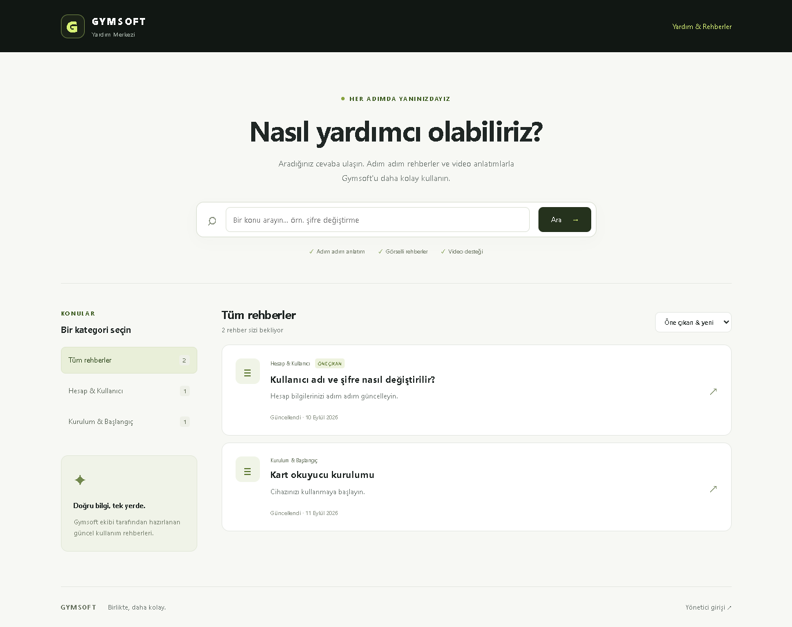

# Gymsoft · Web Uygulamaları

**Yardım içerikleri, kart tasarımları ve cihaz yönetimi için ortak depo.**

`KartTasarim`, üç web uygulamasını ve bunları bir araya getiren Uygulama Merkezi'ni barındırır. Her uygulamanın amacı, erişim biçimi ve dosyaları aşağıda ayrı gösterilmiştir. Depo adı ve mevcut web adresleri korunur.

[Uygulama Merkezi'ni aç](https://gymsoft-software.github.io/KartTasarim/uygulama-merkezi.html) · [Dokümantasyon](docs/README.md) · [Geliştirme ve yayın](docs/GELISTIRME.md) · [Dosya düzeni](docs/PROJE_YAPISI.md)

## Hangi uygulamayı arıyorsunuz?

| Uygulama | Ne için kullanılır? | Kim kullanabilir? | Bağlantılar |
| --- | --- | --- | --- |
| **Forum / Yardım Merkezi** | Rehber arama ve okuma; görsel ve video destekli yardım içerikleri. Yönetim ekranında yazı, kategori ve yayın yönetimi. | Okuma herkese açık; içerik yönetimi atanmış yönetici hesabıyla. | [Siteyi aç](https://gymsoft-software.github.io/KartTasarim/Destek/) · [Yönetici girişi](https://gymsoft-software.github.io/KartTasarim/Destek/admin.html) · [Kullanım rehberi](docs/yardim-merkezi/KULLANIM_REHBERI.md) |
| **Kart Tasarım Kataloğu** | Kartların ön ve arka yüzlerini bulma, büyütme, orijinal görsele ulaşma ve dosya adını paylaşma. | Giriş gerektirmez. | [Siteyi aç](https://gymsoft-software.github.io/KartTasarim/kart-tasarim.html) · [Kullanım rehberi](docs/kart-tasarim/KULLANIM_REHBERI.md) |
| **Raspberry Manager** | Raspberry Pi ve turnike yönetimi; ağ taraması, SSH, kurulum ve durum izleme. | Yardım Merkezi ile aynı yönetici hesabı. Cihaz işlemleri ayrıca Local Agent gerektirir. | [Paneli aç](https://gymsoft-software.github.io/KartTasarim/RaspberryManager/) · [Kurulum ve giriş](RaspberryManager/README.md) |

**Siteye giriş:** [Ana adres](https://gymsoft-software.github.io/KartTasarim/) müşterileri Yardım Merkezi'ne yönlendirir. Tüm uygulamaların listesi [Uygulama Merkezi](https://gymsoft-software.github.io/KartTasarim/uygulama-merkezi.html) adresindedir.

Forum bölümü mevcut sürümde bir Yardım Merkezi'dir; müşteri üyeliği, yorum ve müşteri konu açma özelliği bulunmaz. Kart kataloğu mevcut görselleri sunar; kart düzenleme veya baskı siparişi aracı değildir.

## Uygulamalardan görüntüler

| Yardım Merkezi | Kart Tasarım Kataloğu |
| --- | --- |
| [](docs/yardim-merkezi/KULLANIM_REHBERI.md) | [](docs/kart-tasarim/KULLANIM_REHBERI.md) |

Görsellere tıklayarak adım adım rehberleri açabilirsiniz. Yardım Merkezi görüntüleri örnek içeriklerle, kart kataloğu görüntüleri depodaki kartlarla yerel ortamda alınmıştır.

## Hızlı başlangıç

Node.js 24 ve npm ile proje kökünde:

```sh
npm ci
npm run build
npm run dev
```

Ardından **http://127.0.0.1:4173/uygulama-merkezi.html** adresini açın.

- **İçerik yönetimi için:** [Supabase kurulumunu ve yönetici atamasını](Destek/README.md) tamamlayın.
- **Kart eklemek için:** [KartKatalog klasörünün açıklamasını](KartKatalog/README.md) izleyin.
- **Cihaz yönetimi için:** [Raspberry Manager bağlantı adımlarını](RaspberryManager/README.md) izleyin; Local Agent'ı çalıştırın.

Komutlar, testler, yapılandırma ve GitHub Pages yayını: **[Geliştirme kılavuzu](docs/GELISTIRME.md)**.

## Dosyalar nerede?

```text
KartTasarim/
├── README.md                    # Deponun tanıtımı ve başlangıç noktası
├── index.html                   # Müşterileri Yardım Merkezi'ne yönlendirir
├── uygulama-merkezi.html         # Üç uygulamanın ortak giriş sayfası
├── kart-tasarim.html             # Kart kataloğunun korunan web adresi
├── assets/
│   ├── kart-tasarim/             # Kataloğun JavaScript, CSS ve ayarları
│   └── home.css                  # Uygulama Merkezi stilleri
├── KartKatalog/                  # Kart görselleri
├── Destek/                      # Yardım Merkezi uygulaması ve teknik kurulum
├── RaspberryManager/            # Cihaz yönetimi uygulaması ve Local Agent
├── docs/                        # Kullanım, geliştirme ve arşiv belgeleri
├── scripts/                     # Derleme, yerel sunucu ve rehber görselleri
├── tests/                       # Birim, veritabanı ve tarayıcı testleri
└── _config.yml                  # GitHub Pages yayın kapsamı
```

Uygulama adresleri korunurken kullanım rehberleri `docs/` altında toplanmıştır. Eski rehber adreslerindeki kısa dosyalar yeni konuma bağlantı verir. Yeni dosya eklemeden önce **[dosya yerleşim kurallarına](docs/PROJE_YAPISI.md)** bakın.

## Erişim ve yayın modeli

Web arayüzleri GitHub Pages üzerinde statik olarak sunulur. Yardım Merkezi'nin veritabanı, oturumları ve medya erişimi Supabase üzerinden yönetilir. Raspberry Manager, aynı Supabase yönetici hesabını kullanır; cihaz işlemleri yerel `GymsoftAgent.exe` ve SSH üzerinden yürür.

GitHub Pages'teki giriş ekranı statik kaynak dosyalarını veya Agent indirmesini gizlemez. Yerel Agent API'si bu arayüzdeki Supabase girişinden ayrı çalışır. Ayrıntılar için [yayın ve erişim notlarına](docs/GELISTIRME.md#yayın-ve-erişim) bakın.
