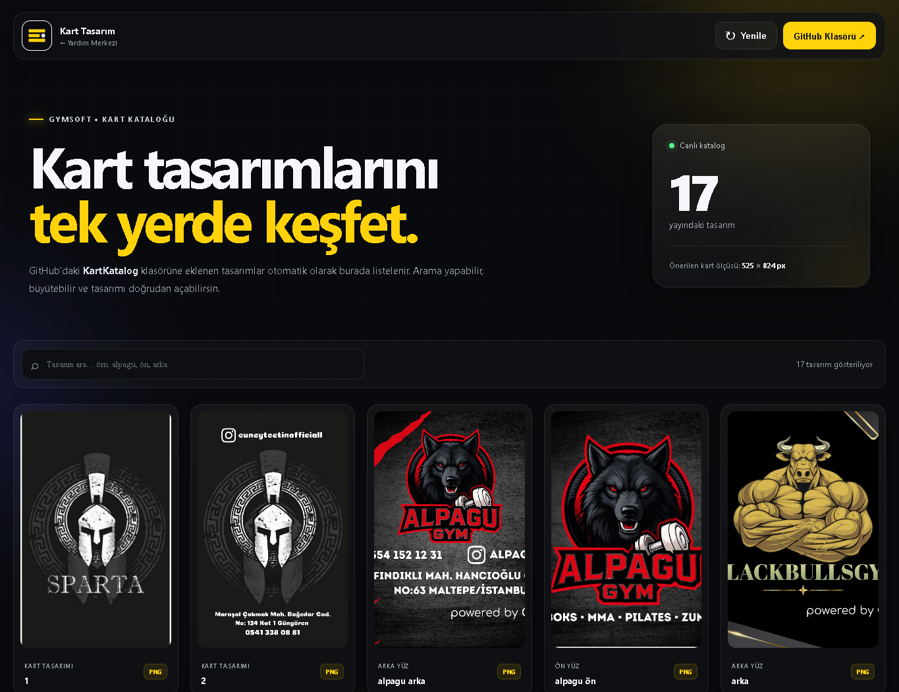
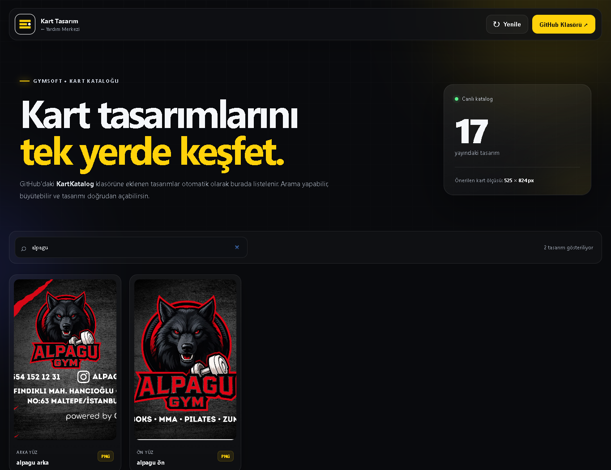
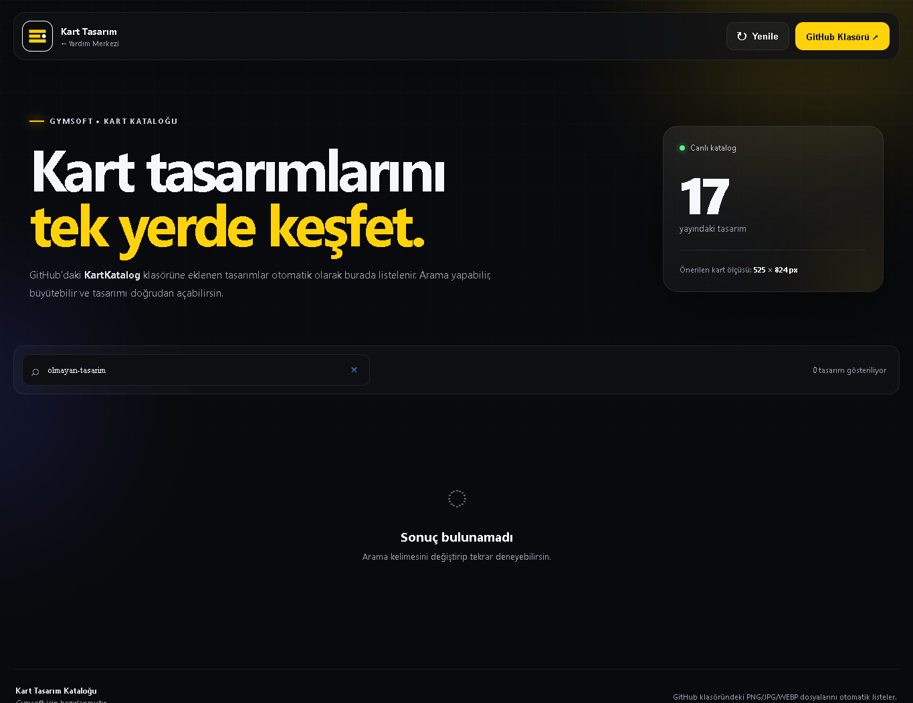
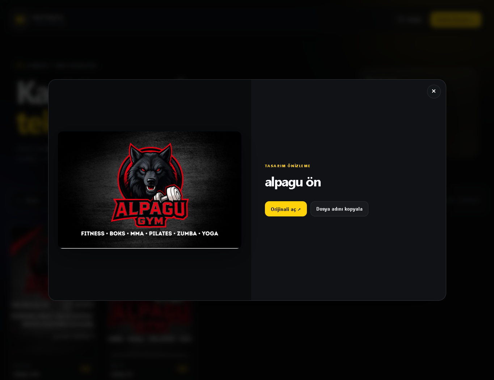
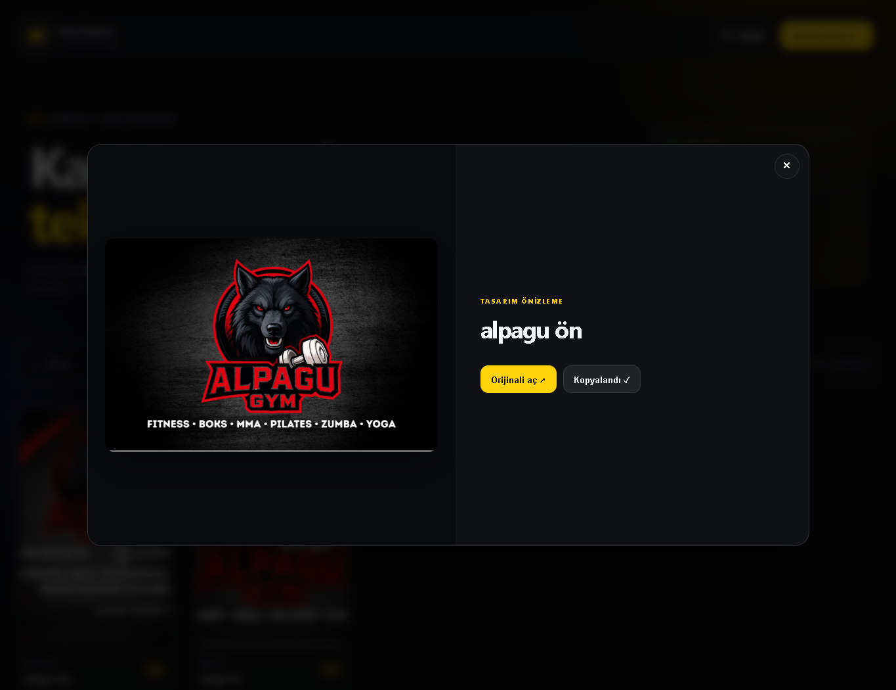
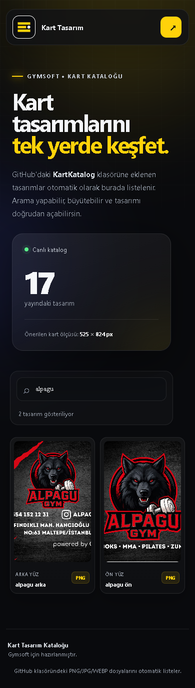

# Kart Tasarım Kataloğu — Kullanım Rehberi

Bu rehber, Gymsoft kart tasarımlarını bulmayı, ön ve arka yüzleri incelemeyi, orijinal görseli açmayı ve seçilen dosyanın adını paylaşmayı anlatır.

**Katalog adresi:** https://gymsoft-software.github.io/KartTasarim/kart-tasarim.html

> Ekran görüntüleri 21 Eylül 2026 tarihindeki uygulamadan, projede bulunan gerçek kart görselleriyle yerel ortamda alınmıştır. Görüntüleme sırasında GitHub'a dosya yüklenmemiş veya canlı katalog değiştirilmemiştir. Yayındaki tasarım sayısı zamanla değişebilir.

## İçindekiler

1. [Katalog ne işe yarar?](#1-katalog-ne-işe-yarar)
2. [Kataloğu açma ve ekranı tanıma](#2-kataloğu-açma-ve-ekranı-tanıma)
3. [Tasarım arama](#3-tasarım-arama)
4. [Ön ve arka yüzü inceleme](#4-ön-ve-arka-yüzü-inceleme)
5. [Orijinal görseli açma ve kaydetme](#5-orijinal-görseli-açma-ve-kaydetme)
6. [Dosya adını kopyalama ve tasarımı bildirme](#6-dosya-adını-kopyalama-ve-tasarımı-bildirme)
7. [Kataloğu yenileme](#7-kataloğu-yenileme)
8. [Telefonda kullanım](#8-telefonda-kullanım)
9. [Kataloğa tasarım ekleme — yetkili kullanıcı](#9-kataloğa-tasarım-ekleme--yetkili-kullanıcı)
10. [Sık karşılaşılan durumlar](#10-sık-karşılaşılan-durumlar)

## 1. Katalog ne işe yarar?

Katalog, `KartKatalog` klasöründeki kart görsellerini tek sayfada listeler. Kullanmak için uygulama içinde giriş yapmanız gerekmez.

| İşlem | Kullanım |
| --- | --- |
| Tasarım bulma | Dosya adına göre arayın. |
| Detayları inceleme | Kart görseline tıklayıp önizlemeyi açın. |
| Orijinal dosyaya ulaşma | Önizlemedeki **Orijinali aç** bağlantısını kullanın. |
| Seçilen tasarımı bildirme | **Dosya adını kopyala** düğmesiyle tam dosya adını alın. |
| Listeyi güncelleme | Üstteki **Yenile** düğmesine basın. |

Bu sayfa bir görsel katalogdur. Kartın üzerindeki yazıları değiştirme, logo yerleştirme, yeni kart çizme veya baskı siparişi verme özelliği bulunmaz.

## 2. Kataloğu açma ve ekranı tanıma

1. Katalog adresini tarayıcınızda açın.
2. Tasarımların yüklenmesini bekleyin.
3. Sayfayı aşağı kaydırarak kartları inceleyin.



*Ana ekranın ilk bölümü. Diğer tasarımlar için aşağı kaydırın.*

| Ekran alanı | Anlamı |
| --- | --- |
| Yayındaki tasarım | Katalogdan yüklenen toplam görsel dosyası sayısıdır. Ön ve arka yüz ayrı dosyalarsa ayrı sayılır. |
| Tasarım ara… | Dosya adında geçen kelimeleri arar. |
| “… tasarım gösteriliyor” | Mevcut aramaya uyan sonuç sayısıdır. |
| Ön yüz / Arka yüz / Kart tasarımı | Dosya adından belirlenen görsel etiketidir. |
| PNG, JPG gibi uzantı | Görselin dosya biçimidir. |
| GitHub Klasörü | Kaynak tasarım klasörünü yeni sekmede açar. |
| Sol üstteki marka bağlantısı | Yardım Merkezi'ne dönmenizi sağlar. |

## 3. Tasarım arama

1. **Tasarım ara…** alanına tıklayın.
2. Tasarım adını veya dosya adından bir parçayı yazın. Örneğin `alpagu` yazabilirsiniz.
3. Sonuçlar yazdıkça güncellenir; ayrıca arama düğmesine basmanız gerekmez.
4. Tüm tasarımları yeniden görmek için arama alanını tamamen temizleyin.



*“alpagu” araması, bu kelimeyi içeren dosyaları birlikte gösterir.*

Arama, görselin üzerinde yazan metni okumaz; **dosya adını** tarar. `ön` ve `arka` ifadeleriyle de arama yapabilirsiniz. Türkçe karakterleri dosya adındaki biçimiyle yazın; `on` ile `ön` aynı arama değildir.

### Sonuç bulunamazsa

Arama kelimesini kısaltın, yazımı kontrol edin veya alanı temizleyin. **Sonuç bulunamadı** mesajı, arama koşuluna uyan dosya olmadığını belirtir.



## 4. Ön ve arka yüzü inceleme

1. İncelemek istediğiniz kart görseline tıklayın. Bilgisayarda görselin üzerine geldiğinizde **Büyüt** ifadesi görünür.
2. Açılan önizlemede kartın detaylarını inceleyin.
3. Sağdaki başlıktan doğru tasarımı açtığınızı kontrol edin.
4. Pencereyi sağ üstteki **×** düğmesiyle veya **Esc** tuşuyla kapatın.
5. Diğer yüzü görmek için listede ilgili ön veya arka yüz dosyasını açın.



*Ön ve arka yüz ayrı görsellerdir; önizleme içinde otomatik yüz çevirme bulunmaz.*

**Örnek seçim:** `alpagu ön.png` dosyasını inceleyin, önizlemeyi kapatın ve `alpagu arka.png` dosyasını açın. Etiketler dosya adından üretildiğinden, seçiminizi görselin kendisini de kontrol ederek yapın.

## 5. Orijinal görseli açma ve kaydetme

1. Kartın önizlemesini açın.
2. **Orijinali aç ↗** bağlantısına tıklayın.
3. Görselin asıl dosyası yeni sekmede açılır.
4. Kaydetmek için bilgisayarda görsele sağ tıklayıp tarayıcınızın görsel kaydetme seçeneğini kullanın. Telefonda görsele uzun basarak kaydetme menüsünü açabilirsiniz.

Kaydetme seçeneğinin adı tarayıcıya göre değişebilir. **Orijinali aç** düğmesi doğrudan indirme başlatmak yerine dosyayı görüntüler.

Katalog ekranının görüntüsünü almak yerine orijinal dosyayı kaydedin; böylece görselin mevcut çözünürlüğünü korursunuz. Sayfada önerilen ölçü **525 × 824 piksel** olarak belirtilir. Bu bir görsel boyutu önerisidir; baskı ölçüsü, kesim payı veya baskı çözünürlüğü ayarı değildir.

## 6. Dosya adını kopyalama ve tasarımı bildirme

1. Seçtiğiniz tasarımın önizlemesini açın.
2. **Dosya adını kopyala** düğmesine basın.
3. **Kopyalandı ✓** mesajını görün.
4. Dosya adını mesajınıza veya notunuza yapıştırın.



*Bu düğme görseli veya bağlantıyı değil, uzantısı dahil tam dosya adını kopyalar.*

Örnek bildirim:

```text
Seçtiğim kart tasarımı:
Ön yüz: alpagu ön.png
Arka yüz: alpagu arka.png
```

Bir bağlantı paylaşmak istiyorsanız **Orijinali aç** ile açılan sekmenin adresini kopyalayın. Katalogdaki önizlemeyi açmanız, adres çubuğunda tasarıma özel bir bağlantı oluşturmaz.

## 7. Kataloğu yenileme

Yeni tasarım eklendiğinde veya dosyalar güncellendiğinde üstteki **Yenile** düğmesine basın.

- Liste GitHub klasöründen yeniden alınır.
- Yükleme sırasında düğme geçici olarak devre dışı kalır.
- Arama alanındaki kelime korunur. Yeni dosyayı göremiyorsanız arama alanını temizleyin.

Sayfadaki **Canlı katalog** ifadesi dosyaların kaynaktan yüklendiğini belirtir; açık sayfa belirli aralıklarla kendiliğinden yenilenmez. Güncel dosyaları görmek için **Yenile** düğmesini kullanın veya sayfayı yeniden açın.

## 8. Telefonda kullanım

1. Aynı katalog adresini telefonunuzda açın.
2. Arama alanına tasarımın adını yazın.
3. Kartları aşağı kaydırarak inceleyin.
4. Bir karta dokunup önizlemeyi açın.
5. Orijinal dosyaya ulaşmak veya dosya adını kopyalamak için önizlemedeki düğmeleri kullanın.



*Mobil görünüm: aynı arama ve önizleme işlemleri dokunarak kullanılabilir.*

## 9. Kataloğa tasarım ekleme — yetkili kullanıcı

Katalogda dosya yükleme formu bulunmaz. Yeni tasarımlar, GitHub deposuna yazma yetkisi olan kişi tarafından kaynak klasöre eklenir.

1. **GitHub Klasörü ↗** bağlantısıyla kaynak klasörü açın.
2. Görsel dosyasını deponun `main` dalındaki **KartKatalog** klasörünün doğrudan içine ekleyip değişikliği kaydedin. Alt klasörlerin içindeki görseller otomatik taranmaz.
3. Ön ve arka yüzleri anlaşılır adlarla ayrı ayrı ekleyin. Örnek: `ornek ön.png` ve `ornek arka.png`.
4. Kataloğa dönüp **Yenile** düğmesine basın.
5. Dosya adıyla arayın ve her iki yüzün de doğru açıldığını kontrol edin.

Desteklenen uzantılar: **PNG, JPG, JPEG, WEBP, GIF ve AVIF**. PSD, AI ve PDF gibi çalışma dosyaları katalogda listelenmez.

Mevcut bir dosyayı değiştirmek veya kaldırmak da kaynak klasör üzerinden yapılır. Katalog için ayrı bir yönetici hesabı yoktur; dosya yönetimi GitHub depo yetkileriyle yapılır. Kaynak repo veya klasör taşınırsa proje sorumlusunun `assets/kart-tasarim/config.js` ayarlarını güncellemesi gerekir.

## 10. Sık karşılaşılan durumlar

| Durum | Yapılacak işlem |
| --- | --- |
| Sonuç bulunamadı | Aramayı kısaltın veya alanı temizleyin. Aramanın dosya adına göre yapıldığını unutmayın. |
| Ön yüz görünüyor, arka yüz görünmüyor | Ortak tasarım adıyla arayın. Arka yüz dosyası kaynak klasöre eklenmemiş olabilir. |
| Yeni tasarım görünmüyor | Arama filtresini temizleyip **Yenile** düğmesine basın. Dosyanın doğru dalda, doğrudan `KartKatalog` içinde ve desteklenen biçimde olduğunu kontrol ettirin. |
| Katalog GitHub üzerinden yüklenemedi | İnternet bağlantınızı kontrol edin. Bir süre sonra yeniden deneyin; devam ederse depo erişimi ve yapılandırma için proje sorumlusuna başvurun. |
| GitHub Klasörü erişim istiyor | Katalog girişi ile GitHub yetkileri ayrıdır. Özel depo erişimi için depo yöneticisine başvurun. |
| Görsel önizlemede küçük | **Orijinali aç** ile dosyayı yeni sekmede inceleyin. |
| Dosya adı kopyalanmıyor | Tarayıcının pano erişimine izin verdiğini kontrol edin. **Kopyalandı ✓** mesajı oluşmuyorsa dosya adını kaynak klasörden alabilirsiniz. |
| Yenilemeden sonra hâlâ az tasarım görünüyor | Arama kelimesi yenilemede korunur; tüm dosyalar için aramayı temizleyin. |
| Kart üzerindeki yazıyı değiştirmek istiyorum | Katalogda düzenleme aracı yoktur. Dosya adını ilgili tasarım sorumlusuna iletin. |

---

**Ekran görüntülerini yenilemek için:** Proje kökünde bağımlılıklar kurulu olduğunda `node scripts/capture-card-guide.mjs` komutunu çalıştırın. Windows'ta Microsoft Edge, diğer sistemlerde Playwright Chromium gerekir. Komut mevcut `KartKatalog` dosyalarını yerel arayüzde kullanır; canlı GitHub verisini değiştirmez. Örnek akış `alpagu ön.png` ve `alpagu arka.png` dosyalarını kullanır.
